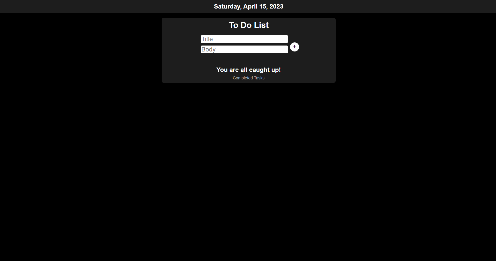

# Tasklist
A simple Flask app to keep track of what needs to get done!



## Installation
Use the package manager [pip](https://pip.pypa.io/en/stable/) to install requirements
```bash 
$ pip install -r requirements.txt
```

## Initialize the database
```bash
flask init-db
```

## Start the server
```bash
flask run
```